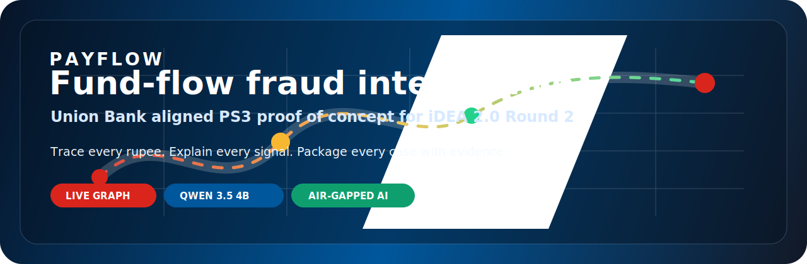
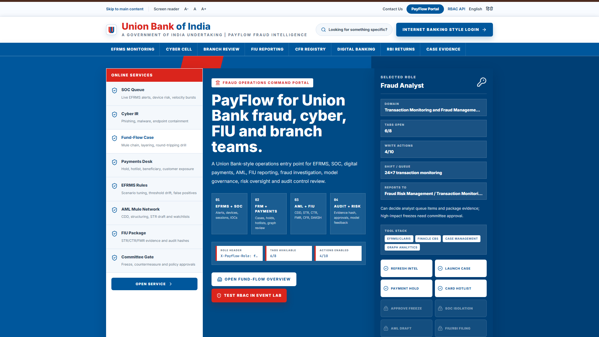
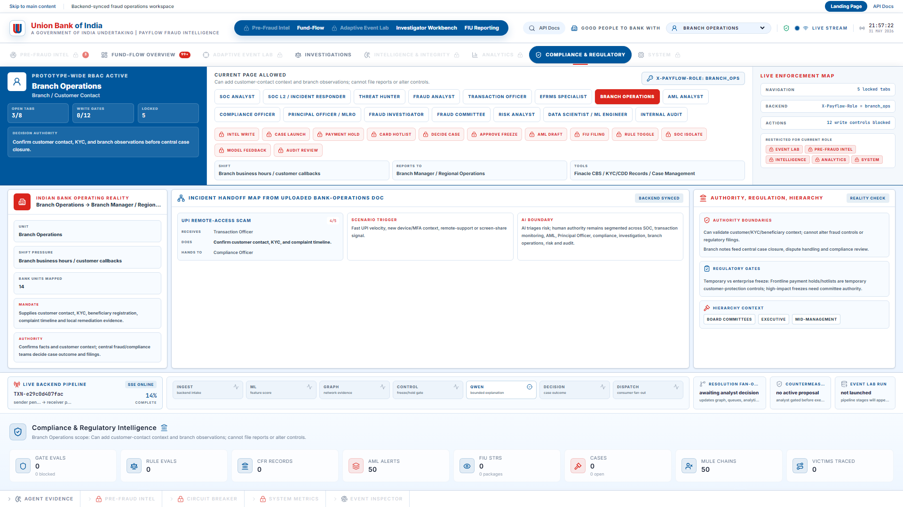
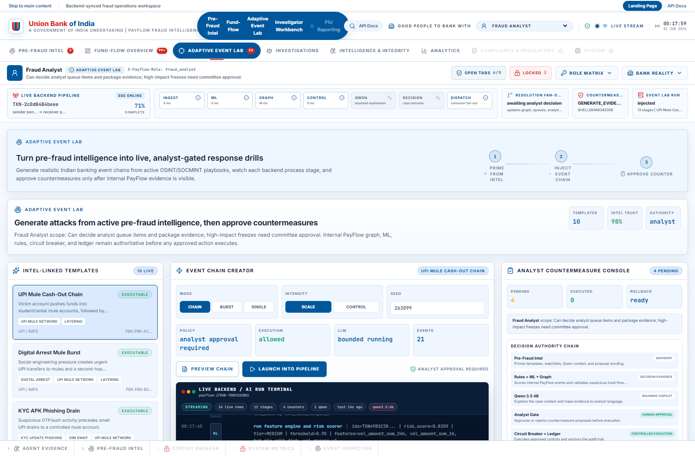
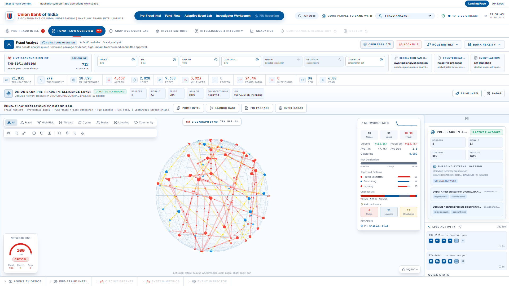
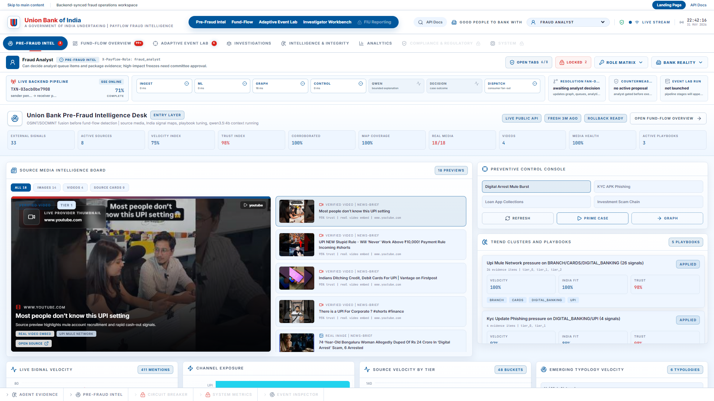
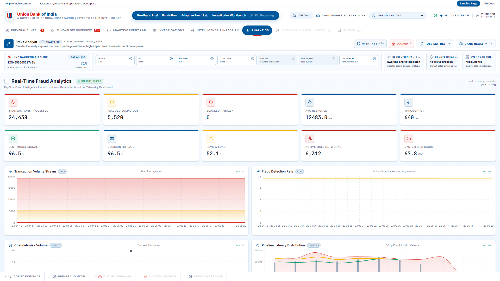
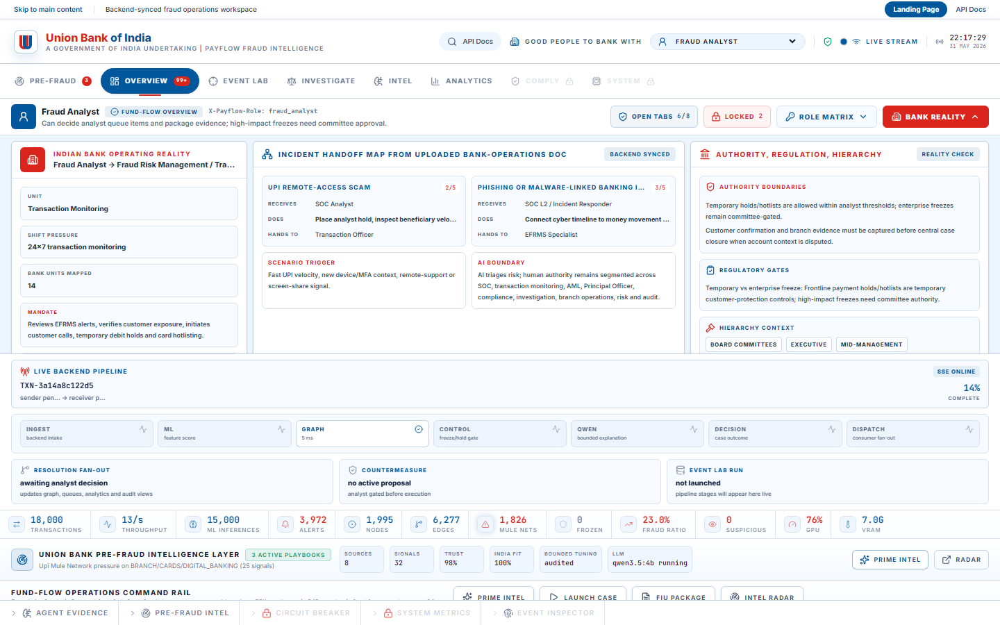

<div align="center">



# PayFlow

### Intelligent Fund Flow Tracking for Fraud Detection in Union Bank of India

**iDEA 2.0 National Level Hackathon Round 2 | Problem Statement PS3 | Team Aryabhata**

[](https://python.org)
[](https://fastapi.tiangolo.com)
[](https://react.dev)
[](https://typescriptlang.org)
[](https://ollama.com)
[](#problem-being-solved)

</div>

---

## Repository Deliverable Status

This repository is the public GitHub deliverable for the iDEA 2.0 Round 2 submission. It contains the complete PayFlow proof of concept, a runnable FastAPI backend, a Union Bank themed React prototype, synthetic fraud-event generation, graph and ML based fund-flow investigation modules, Qwen-powered explanation support, role-based access controls, tests, and curated screenshots from a live local run.

| Required GitHub README Coverage | Where It Is Covered |
|---|---|
| Problem being solved | [Problem Being Solved](#problem-being-solved) and [Why It Matters](#why-it-matters-for-union-bank-and-india) |
| How to run locally | [Running PayFlow Locally](#running-payflow-locally) |
| Libraries and dependencies | [Libraries and Dependencies](#libraries-and-dependencies) |
| Sample dataset link or synthetic data instructions | [Synthetic Data and Demo Event Generation](#synthetic-data-and-demo-event-generation) |
| Known limitations | [Known Limitations](#known-limitations) |

---

## Problem Being Solved

PayFlow addresses **PS3: Tracking of Funds within Bank for Fraud Detection**. The problem statement asks for an intelligent system that maps and visualises the end-to-end movement of funds within a bank across accounts, products, branches and channels. It must detect suspicious patterns such as rapid layering through multiple accounts, circular transactions, structuring below reporting thresholds, sudden activation of dormant accounts for high-value transfers, and mismatch between declared customer profiles and actual fund movement behaviour.

In the Indian banking context, this is a high-urgency problem because digital payments now move faster than traditional investigation workflows. UPI and IMPS make legitimate payments instant, but the same speed is exploited by mule networks that split funds, pass them through many accounts, and consolidate them before a branch, fraud desk or compliance team can reconstruct the flow. For Union Bank of India, a public sector bank with a broad inclusion mandate, the challenge is not only to identify fraud. It is to preserve digital trust for customers who depend on reliable, low-friction payments: pensioners, students, rural households, small merchants, migrant workers and Jan Dhan account holders.

The core operational gap is that many fraud systems still begin with isolated alerts. A single transaction can be high velocity, a dormant account can suddenly activate, or a beneficiary can look unusual; however, each signal is incomplete without the fund journey around it. PayFlow treats the money trail as the primary evidence object. It asks where the funds started, where they moved next, whether the movement forms a mule chain or circular path, whether the behaviour contradicts customer profile, and what action can be justified with evidence.

## Why It Matters for Union Bank and India

India’s payment infrastructure is a national digital public good. Its continued adoption depends on the trust that ordinary customers place in banks when something goes wrong. A victim of social engineering, UPI mule routing or digital arrest fraud does not only need an alert message. They need the bank to trace the path, identify connected accounts, explain what happened, and support action with a clear audit trail.

For Union Bank, PayFlow supports this public sector responsibility by joining investigation, explainability and evidence preparation in one workspace. The project is designed around operational reality: fraud analysts need graph context, branch teams need customer-facing clarity, compliance users need FIU-ready evidence, and leadership needs measurable risk visibility without treating every inclusion customer as suspicious by default.

---

## Solution Overview

PayFlow is a live fraud operations layer for fund-flow investigation. It converts transaction and event activity into an interactive graph, enriches it with risk scoring and graph analytics, shows live backend pipeline stages, and produces bounded AI explanations that are tied to actual bank evidence rather than generic narration. The prototype is not a static dashboard. It demonstrates event injection, synthetic fraud-chain creation, live graph updates, analytics, role-based access, pipeline transparency, countermeasure review and evidence packaging.

The system is intentionally built as an overlay rather than a core-banking replacement. A bank can pilot PayFlow beside existing fraud operations, feed it historical or simulated transaction events, use it to investigate PS3 patterns, and gradually connect it to selected operational channels. Human authority remains intact: PayFlow can propose and explain, but analysts and approved banking roles decide holds, freezes, escalations and compliance actions.

### Proof of Concept Capabilities

| Capability | What the Prototype Demonstrates |
|---|---|
| Fund-flow graph | Live visual tracking of accounts, mule hops, consolidation nodes, suspicious communities and downstream movement. |
| Fraud AI core | ML scoring, graph heuristics, circuit-breaker logic and Qwen 3.5 4B explanations working as investigator assistance. |
| Real-time pipeline visibility | Backend stages stream into the UI so evaluators can see ingestion, ML, graph, control, Qwen and dispatch activity. |
| Role-based access control | Banking personas see different allowed tabs, locked actions and authority boundaries. |
| Evidence packaging | Investigation output is structured for case review, analyst decision and FIU-style reporting context. |
| Union Bank design language | Interface uses Union Bank brand colours, banking-grade navigation and role-aware operational framing. |

---

## Prototype Screenshots

The following screenshots were captured from the running local proof of concept. They are included in the repository so evaluators can inspect the prototype even before running it.

### Union Bank Entry Experience



The landing page frames PayFlow as a Union Bank aligned fraud operations workspace rather than a generic AI dashboard. Users enter the console with a banking role, and that role is carried into navigation, action gates and backend requests.

### Role-Based Access and Banking Authority



The RBAC layer makes banking authority visible. Restricted tabs and actions are locked for roles without approval rights, while permitted users can inspect the operational evidence relevant to their function.

### Live Backend and AI Run Terminal



Whenever a fraud event or Event Lab chain is launched, the terminal streams live backend events from the same state that drives the graph and explainability panels. It shows event ingestion, ML scoring, graph heuristics, circuit-breaker controls, Qwen 3.5 4B explanations, countermeasure proposals and dispatch activity.

### Dynamic Fund-Flow Graph



The fund-flow graph gives investigators a network view of suspicious transaction movement. This is the core PS3 response: funds are traced as relationships, not just rows.

### Pre-Fraud Intelligence and Media Signals



PayFlow includes pre-fraud intelligence panels that connect emerging public-source fraud signals to internal playbooks. These signals are advisory context only; internal PayFlow evidence remains authoritative before action.

### Analytics and Operational Metrics



Analytics panels show live fraud-rate, channel, typology and latency views so the prototype feels like an operational command centre rather than a single-case tool.

### Bank Reality and Enforcement View



The bank reality view shows role authority, locked controls and enforcement state. This makes governance visible and prevents the prototype from implying that AI can unilaterally execute high-impact banking actions.

---

## Technical Proof of Concept in Plain Language

PayFlow has a FastAPI backend and a React frontend. The backend maintains the fraud pipeline, generates synthetic events, builds graph structures, scores risk, coordinates analyst and countermeasure flows, exposes REST endpoints, and streams live events through Server-Sent Events. The frontend presents those backend states through a Union Bank themed operations console.

The AI model is deliberately local-first. Qwen 3.5 4B is served through Ollama and used as a bounded explanatory agent. This choice is important for banking because an open-source model can run inside an air-gapped or bank-controlled environment. Sensitive customer and transaction context does not need to leave the institution through external API calls. Local GPU inference also makes the cost model more predictable for public sector banking: once the infrastructure is provisioned, the bank avoids recurring per-token cloud billing for routine explanations.

Graph analytics and machine learning are used together. ML helps score risk from behavioural and transaction features. Graph logic exposes connected movement: mule chains, rapid forwarding, centrality anomalies, suspicious communities, circular transfer patterns and downstream beneficiary paths. Qwen then translates the evidence into a human-readable explanation, while the analyst remains responsible for decisions.

---

## Codebase Structure

```text
Pay_Flow/
├── config/                         Runtime settings, Ollama/GPU configuration, VRAM controls
├── docs/assets/                    README hero, curated screenshots and submission assets
├── frontend/app/                   React 19 + TypeScript + Vite prototype console
│   ├── src/components/             Layout, panels, graph, simulation and investigation UI
│   ├── src/pages/                  Landing, overview, pre-fraud, fund-flow, event lab, analytics
│   ├── src/stores/                 Zustand stores for live SSE-backed application state
│   └── src/lib/                    API client, RBAC model, theme, sanitization and utilities
├── scripts/                        Ollama model setup and deployment helper scripts
├── src/api/                        FastAPI app, routes, SSE broadcaster and PS3 case endpoints
├── src/blockchain/                 Embedded audit ledger and cryptographic evidence primitives
├── src/domain/                     Union Bank operating model and banking role definitions
├── src/graph/                      Fund-flow graph builder and suspicious chain detection
├── src/ingestion/                  Event schemas, validators and synthetic transaction generators
├── src/intel/                      Pre-fraud intelligence and playbook services
├── src/llm/                        Qwen orchestration, prompts, tools and local model health
├── src/ml/                         Feature engineering, scoring and model components
├── src/simulation/                 Fraud scenarios, Event Lab and attack generators
├── tests/                          Unit and integration tests for backend, RBAC and simulation
├── pyproject.toml                  Python dependency and packaging metadata
└── README.md                       This submission-oriented repository guide
```

---

## Running PayFlow Locally

The local run uses two processes: the FastAPI backend on port `8000` and the Vite frontend on port `3006`. Ollama is optional for basic UI exploration but recommended because Qwen 3.5 4B is part of the proof of concept.

### Prerequisites

Use Python 3.11 or newer, Node.js 20 or newer, npm, Git and a working C++/Python build environment for scientific packages. For the AI explanation path, install Ollama and pull the local model used by the prototype:

```powershell
ollama pull qwen3.5:4b
```

If the exact tag is unavailable in your Ollama registry, use the closest Qwen 3.5 4B compatible local model and set `OLLAMA_MODEL` accordingly.

### Backend Setup

```powershell
cd C:\Users\sayan\Downloads\Aryabhata\Pay_Flow
python -m venv .venv
.\.venv\Scripts\Activate.ps1
python -m pip install --upgrade pip
pip install -e ".[dev]"

$env:OLLAMA_URL = "http://localhost:11434"
$env:OLLAMA_MODEL = "qwen3.5:4b"
python -m uvicorn src.api.app:create_app --factory --host 127.0.0.1 --port 8000 --reload
```

The backend exposes the API at `http://127.0.0.1:8000`. The OpenAPI documentation is available at `http://127.0.0.1:8000/docs`, and the Qwen probe endpoint is available at `http://127.0.0.1:8000/ask`.

### Frontend Setup

```powershell
cd C:\Users\sayan\Downloads\Aryabhata\Pay_Flow\frontend\app
npm install
npm run dev -- --host 127.0.0.1 --port 3006
```

Open `http://127.0.0.1:3006`. The frontend proxies `/api` calls to the backend on port `8000`, so the live prototype works as long as both processes are running.

---

## Synthetic Data and Demo Event Generation

The repository does not require a real customer dataset. The proof of concept uses synthetic events and generated fraud chains so that it can be evaluated safely without exposing banking data. The Event Lab inside the UI provides templates such as UPI mule cash-out chains, digital arrest mule bursts, KYC APK phishing drain patterns and merchant QR misuse clusters.

Synthetic data can be generated from the UI by opening **Adaptive Event Lab**, selecting a template, and clicking **Launch Into Pipeline**. This creates a correlated set of synthetic transaction events, streams them through ingestion and scoring, updates the graph, proposes analyst-gated countermeasures, and shows backend processing in the live terminal.

The same can be triggered through the API:

```powershell
Invoke-RestMethod `
  -Method Post `
  -Uri http://127.0.0.1:8000/api/v1/simulation/event-lab/runs `
  -ContentType "application/json" `
  -Body '{"template_id":"upi_mule_cashout","mode":"chain","intensity":"scale","analyst_required":true}'
```

Manual custom events can also be injected through the UI or through:

```powershell
Invoke-RestMethod `
  -Method Post `
  -Uri http://127.0.0.1:8000/api/v1/simulation/inject-event `
  -ContentType "application/json" `
  -Body '{"event_type":"transaction","sender_id":"UBI10000001","receiver_id":"MULE90000001","amount_inr":95000,"channel":"UPI"}'
```

This approach satisfies the sample dataset requirement without distributing sensitive or private banking records.

---

## Libraries and Dependencies

PayFlow combines a Python fraud-intelligence backend with a TypeScript operations console. The Python layer uses FastAPI for APIs and live streaming, NetworkX for graph analysis, XGBoost and scikit-learn for risk scoring and feature workflows, Polars and PyArrow for data processing, PyNaCl and pymerkle for audit/evidence primitives, and Ollama/LangGraph-oriented components for local Qwen explanation workflows. Optional advanced packages such as PyTorch Geometric, Transformers, PEFT, TRL and bitsandbytes support the broader GPU and fine-tuning direction of the prototype.

The frontend uses React 19, TypeScript, Vite, Zustand, TanStack Query, Recharts, Three.js, react-force-graph-3d, Sigma/Graphology, Cytoscape, Lucide icons and Tailwind CSS. These libraries were selected because the prototype must show dense operational data, graph relationships, real-time state changes, role gates and banking-grade interface flows.

The complete Python dependency declaration is in `pyproject.toml`. The complete frontend dependency declaration is in `frontend/app/package.json`.

---

## Real-World Use Cases

PayFlow is designed around practical Union Bank workflows rather than abstract AI demonstrations. A fraud analyst can trace a victim payment through mule hops and consolidation accounts. A branch team can understand whether a customer complaint is isolated or connected to a wider pattern. A compliance officer can review structured evidence for escalation. A fraud operations lead can see channel-level and typology-level risk movement. A platform owner can monitor model availability, local Qwen status and backend processing health.

The most important use case is rapid fund-flow reconstruction. In many fraud scenarios, the first alert is not enough. PayFlow helps reveal whether funds have moved into a star-shaped mule network, whether multiple accounts are round-tripping value, whether a dormant account is suddenly behaving like a pass-through account, or whether several small transfers together form a suspicious structure. This is the difference between seeing a transaction and understanding a fraud journey.

---

## Impact Projection

| Impact Area | Pilot-Level Projection |
|---|---:|
| Fund-flow reconstruction time | 60-75% reduction compared with manual review |
| Linked mule-chain discovery | 30-45% improvement through graph patterning |
| False-positive handling effort | 20-35% reduction by separating isolated anomalies from connected fraud |
| Evidence package preparation | 50-70% faster for analyst and FIU-style case context |
| AI explanation cost | Lower recurring cost through local open-source GPU inference |
| Customer trust | Faster, clearer response for fraud victims and branch teams |

These are pilot-level projections, not production guarantees. They express the realistic operational direction expected when graph-based investigation and evidence automation replace fragmented manual reconstruction.

---

## Security, Governance and Banking Fit

PayFlow is designed with conservative banking assumptions. AI is not allowed to become an unchecked operator. The model explains, summarizes and supports; it does not approve high-impact controls by itself. Role-based access control keeps sensitive views and actions aligned with banking personas. Evidence sanitization prevents the UI from exposing unnecessary sensitive content. The local Qwen path keeps model inference inside a bank-controlled environment.

The prototype also recognizes that public sector banking must balance fraud prevention with inclusion. A high-risk pattern should be explained through evidence, not through broad profiling. This is why the graph and transaction trail matter: they let the bank distinguish genuine low-income digital usage from coordinated suspicious movement.

---

## Known Limitations

PayFlow is a proof of concept, not a certified production banking system. It uses synthetic and simulated transaction events rather than live Union Bank core-banking feeds. The model outputs are bounded and useful for investigator explanation, but final decisions must remain with authorized bank roles. Some advanced GPU paths depend on local hardware, driver compatibility and Ollama model availability. Full production integration would require secure data connectors, enterprise identity, SOC monitoring, formal model validation, audit policy review, privacy assessment, disaster recovery design and approval from the relevant banking governance teams.

The repository intentionally excludes runtime logs, local databases, video files, model binaries and generated test artifacts. Those files are either environment-specific or too large/noisy for a clean public hackathon submission.

---

## Validation Snapshot

During local development the frontend build and lint checks were run from `frontend/app`:

```powershell
npx eslint --max-warnings=0 src
npm run build
```

The live prototype was also smoke-tested in a browser at `http://127.0.0.1:3006/app?tab=threat-sim`, where launching an Event Lab chain produced live terminal rows for the launch request, backend run attachment, ML and graph stages, countermeasure proposals and Qwen 3.5 4B context explanation.

---

## Alignment with Digital India

PayFlow strengthens the trust layer beneath mass digital adoption. It does not slow down UPI or replace human judgement. It helps banks understand misuse at payment speed, gives branch and fraud teams a shared evidence view, and supports accountable escalation. For Union Bank, it can become a practical fraud intelligence overlay across digital payments, branches, cards and future account-to-account rails. For the wider PSU banking ecosystem, the same model can scale wherever high transaction volume, mule-account abuse and regulatory reporting pressure intersect.

> **Core promise:** when fraudulent money moves in seconds, the bank’s understanding of that movement must also move in seconds.

---

## License

This proof of concept is released under the MIT License for hackathon evaluation and educational review. Banking production use would require independent security, compliance, model-risk and legal assessment.
